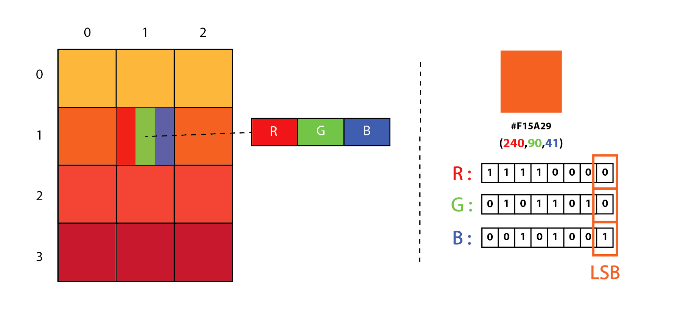

## Steganography tool

`cli` `steganography` `png` `setuptools` `wheel` `click`

### Условие

В этой задачке нужно собрать свой пакет простенькой LSB стенографией.  
Основные функции уже написаны за вас, нужно только обернуть это всё в маленький пакетик и написать cli.  

Про саму LSB стенографию можно почитать, например, [в посте на хабре](https://habr.com/ru/post/422593/). Кратко её можно изобразить следующим образом:



Формально вам нужно:

* Написать консольный интерфейс чтобы можно было вызвать `steganography-tool`
* Написать установщик (`setup`)
* Проверить, что модуль собирается в `wheel` 
* Проверить, что все тесты корректно запускаются на вашем модуле


### Некоторые моменты 

* Весь код в папке будет установлен в тестирующую систему через `pip wheel` & `pip install`
* Из [документации python](https://packaging.python.org/tutorials/packaging-projects/#configuring-metadata): `Static metadata (setup.cfg) should be preferred.`
* В этом модуле используется библиотечка `PIL` (`Pillow`). Её **нет** в тестирующей системе, но можно прописать её в requires к модулю 
* Нужно написать свой `cli`. Для этого можно использовать что угодно, но мы рекомендуем [click](https://palletsprojects.com/p/click/) (тоже нет в тестирующей системе)
* Все сообщения нужно скрывать в картинке `lenna.png`. Чтобы получить к ней доступ после установки нужно пробросить её как `package_data` 
* Тесты без установки, скорее всего, не запустятся 

### Как запустить тесты?

Перед тем, как запустить тесты, нужно установить библиотеку.

```bash
# Собрать wheel для библиотеки steganography_tool
$ ~/.pyenv/versions/shad_env/bin/pip wheel --wheel-dir 06.1.ModulesPackagesImport/steganography_tool/dist 06.1.ModulesPackagesImport/steganography_tool/

# Посмотреть какие файлы упаковались в wheel
$ tar --list -f 06.1.ModulesPackagesImport/steganography_tool/dist/steganography_tool-0.0.1-py3-none-any.whl  

# Устанавливаем собранный wheel для steganography_tool
$ ~/.pyenv/versions/shad_env/bin/pip install 06.1.ModulesPackagesImport/steganography_tool/ --prefer-binary --force-reinstall --find-links 06.1.ModulesPackagesImport/steganography_tool/dist/

# Стал доступен модуль steganography_tool в интерпретаторе
$ steganography-tool

# Теперь можете запустить тесты, которые используют модуль steganography_tool в импортах
$ ~/.pyenv/versions/shad_env/bin/pytest 06.1.ModulesPackagesImport/steganography_tool
```
Причем нужно переустанавливать пакет если вы меняете metadata.


### Command line interface

Нужно реализовать простенький cli. Для этого рекомендуем хорошую и модную библиотечку [click](https://palletsprojects.com/p/click/).  
Более конкретно:

* `steganography-tool` - только help и описание
* `steganography-tool encode [OUTPUT_FILENAME] [SECRET_MESSAGE]` - скрывает сообщение в `lenna.png` и сохраняет в файл
* `steganography-tool decode [INPUT_FILENAME]` - выводит найденное в файле сообщение

После установки это должно выглядеть примерно так
```bash
$ steganography-tool --help
$ steganography-tool encode --help
$ steganography-tool encode encoded.png secret-message 
$ steganography-tool decode --help
$ steganography-tool decode encoded.png
```


## Полезные материалы 
* [https://packaging.python.org/tutorials/packaging-projects/](https://packaging.python.org/tutorials/packaging-projects/)
* [https://docs.python.org/3/tutorial/modules.html](https://packaging.python.org/tutorials/packaging-projects/)
* [https://pythonwheels.com/](https://packaging.python.org/tutorials/packaging-projects/)
* [про lsb](https://habr.com/ru/post/422593/)
* [_древняя_ статья про wheels. только для общего понимания](https://habr.com/ru/post/210450/)
* [click](https://palletsprojects.com/p/click/)
